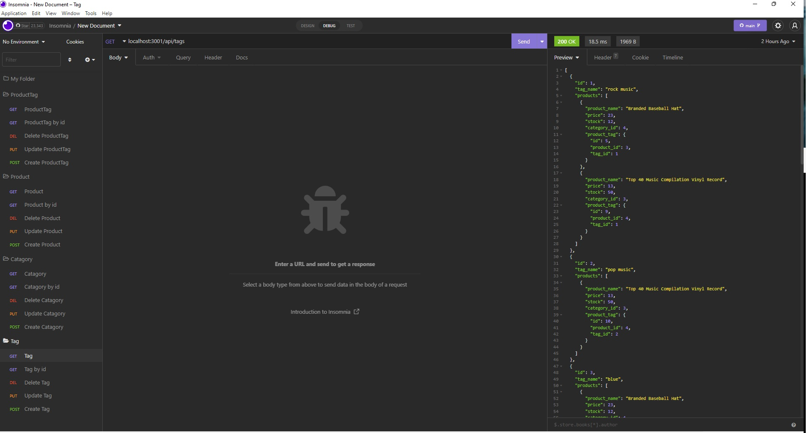

# ORM

## Table of contents

- [Overview](#overview)
  - [The challenge](#the-challenge)
  - [User Story](#user-story)
  - [Acceptance Criteria](#acceptance-criteria)
  - [Screenshot](#screenshot)
  - [Links](#links)
  - [Built with](#built-with)
  - [Instructions](#instructions)
  - [What I learned](#what-i-learned)
  - [Continued development](#continued-development)
  - [Useful resources](#useful-resources)
- [Author](#author)

## Overview

### The challenge

Internet retail, also known as **e-commerce**, is the largest sector of the electronics industry, generating an estimated $29 trillion in 2019. E-commerce platforms like Shopify and WooCommerce provide a suite of services to businesses of all sizes. Due to their prevalence, understanding the fundamental architecture of these platforms will benefit you as a full-stack web developer.

Your task is to build the back end for an e-commerce site by modifying starter code. You’ll configure a working Express.js API to use Sequelize to interact with a MySQL database.

Because this application won’t be deployed, you’ll also need to provide a link to a walkthrough video that demonstrates its functionality and all of the acceptance criteria being met. You’ll need to submit a link to the video and add it to the readme of your project

### User Story

```md
AS A manager at an internet retail company
I WANT a back end for my e-commerce website that uses the latest technologies
SO THAT my company can compete with other e-commerce companies
```

### Acceptance Criteria

```md
GIVEN a functional Express.js API
WHEN I add my database name, MySQL username, and MySQL password to an environment variable file
THEN I am able to connect to a database using Sequelize
WHEN I enter schema and seed commands
THEN a development database is created and is seeded with test data
WHEN I enter the command to invoke the application
THEN my server is started and the Sequelize models are synced to the MySQL database
WHEN I open API GET routes in Insomnia for categories, products, or tags
THEN the data for each of these routes is displayed in a formatted JSON
WHEN I test API POST, PUT, and DELETE routes in Insomnia
THEN I am able to successfully create, update, and delete data in my database
```

### Screenshot



### Links

- Solution URL: [GitHub](https://github.com/Snufalufakis/ORM-eCom)
- Live Site URL: [Youtube](https://youtu.be/OMAfjPITSMM)

### Built with

- JavaScript
- MySQL2
- Sequelize

### Instructions

Have MySQL installed and running. Then run the following commands:

```
npm run seeds &&
npm start
```

### What I learned

This snippet of code was the reason for hours of searching why my insomia was not working. Misspelling my routes was the reason for the problem. I learned that I need to be more careful when typing out my routes.

```

router.use("/categories", categoryRoutes);
router.use("/products", productRoutes);
router.use("/tags", tagRoutes);

```

### Continued development

Still need to grind at the backend of development. I need to get more comfortable with the backend and how it works. I can read and understand the code but I need to be able to write it myself just as well.

### Useful resources

- [stackoverflow](https://stackoverflow.com) -This is always a goto for most of my error's. I can always find a solution to my problem on this site.

## Author

- Website - [GitHub](https://github.com/Snufalufakis)
- Twitter - [@Snufalufakis2](https://www.twitter.com/Snufalufakis2)

```

```
